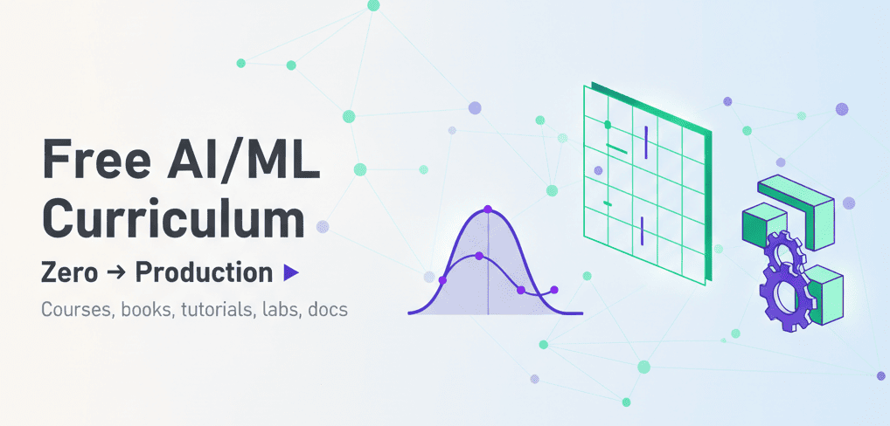

<h1 align="center">Free AI/ML Curriculum · Zero → Production</h1>

  

  Master the fundamentals. build real systems. ship with confidence. 
  University-grade depth. industry-grade pragmatism. 100% free.

  
  
  
  

  Foundations to MLOps. math to LLMs. code to production. no fluff.

  <a href="#what-youll-find-here">Overview</a> •
  <a href="#how-to-use-this-list">How to use</a> •
  <a href="#contributing">Contributing</a> •
  <a href="#license--attribution">License</a>

**Coverage at a glance**

🧮 <a href="#1-mathematics--probability-for-ml-foundations">Math & Probability</a> ·
🐍 <a href="#2-python-data-handling--tools-numpypandassklearnnotebooks">Python & Tools</a> ·
📈 <a href="#3-core-machine-learning-classical-ml">Core ML</a> ·
🧠 <a href="#4-deep-learning--generative-ai-courses-books-framework-tutorials">Deep Learning & GenAI</a> 
🗣️ <a href="#5-natural-language-processing-nlp">NLP</a> ·
👁️ <a href="#6-computer-vision-cv">Computer Vision</a> ·
🎮 <a href="#7-reinforcement-learning-rl">Reinforcement Learning</a> ·
🚀 <a href="#8-mlops--deployment">MLOps</a> 
⏱️ <a href="#9-time-series--forecasting">Time Series</a> ·
🎯 <a href="#10-recommender-systems">Recommenders</a> ·
🎲 <a href="#11-bayesian-methods--probabilistic-programming">Bayesian</a> ·
🕸️ <a href="#12-graph-ml--network-science">Graph ML</a>

  
<b>What is this</b>

  A living. community-maintained index of high-quality. free AI/ML resources. Optimized for self-study and team upskilling. Every entry links straight to the source with a one-liner so you can decide fast.

  
<b>Quick start</b>

  1) Pick a goal. examples. learn the math basics. ship a PyTorch model. understand LLMs. 
  2) Jump to the matching section and follow items top to bottom for a solid path. 
  3) Build one small thing per week. even a notebook counts.

  
<b>Curation principles</b>

  Free to access. no paywalls or trials. Preference for official docs. books. and enduring course sites. Practical order of study. minimal duplication. clear one-line summaries. Periodic refreshes as materials evolve.

  Pro tip. Use your browser Find to jump to keywords like "pandas" or "transformers". 

---

## 1) Mathematics & Probability for ML (Foundations)

1. **MIT OCW 18.06 Linear Algebra** — Prof. Gilbert Strang’s classic linear algebra course with full videos and notes.
   [https://ocw.mit.edu/courses/18-06-linear-algebra-spring-2010/](https://ocw.mit.edu/courses/18-06-linear-algebra-spring-2010/) ([MIT OpenCourseWare][1])
2. **MIT OCW 18.06SC Linear Algebra (OCW Scholar)** — Self-study edition with structured materials and problem sets.
   [https://ocw.mit.edu/courses/18-06sc-linear-algebra-fall-2011/](https://ocw.mit.edu/courses/18-06sc-linear-algebra-fall-2011/) ([MIT OpenCourseWare][2])
3. **3Blue1Brown: Essence of Linear Algebra** — Visual intuition for vectors, matrices, transformations.
   [https://www.youtube.com/playlist?list=PLZHQObOWTQDPD3MizzM2xVFitgF8hE_ab](https://www.youtube.com/playlist?list=PLZHQObOWTQDPD3MizzM2xVFitgF8hE_ab) ([YouTube][3])
4. **Convex Optimization (Boyd & Vandenberghe) [Book]** — Definitive text with free PDF.
   [https://web.stanford.edu/~boyd/cvxbook/bv_cvxbook.pdf](https://web.stanford.edu/~boyd/cvxbook/bv_cvxbook.pdf) ([seas.ucla.edu][4])
5. **The Matrix Cookbook** — Handy formulas for matrix calculus and identities (free PDF).
   [https://www.math.uwaterloo.ca/~hwolkowi/matrixcookbook.pdf](https://www.math.uwaterloo.ca/~hwolkowi/matrixcookbook.pdf) ([math.uwaterloo.ca][5])
6. **MIT OCW 6.041/6.041SC Probabilistic Systems Analysis** — Probability theory with applications.
   [https://ocw.mit.edu/courses/6-041sc-probabilistic-systems-analysis-and-applied-probability-fall-2013/](https://ocw.mit.edu/courses/6-041sc-probabilistic-systems-analysis-and-applied-probability-fall-2013/) ([MIT OpenCourseWare][6])
7. **Harvard Stat 110 (Blitzstein)** — Probability course site with materials + problem sets.
   [https://projects.iq.harvard.edu/stat110/home](https://projects.iq.harvard.edu/stat110/home) ([stat110.hsites.harvard.edu][7])
8. **Harvard Stat 110 Full Lectures (YouTube)** — Complete lecture playlist.
   [https://www.youtube.com/playlist?list=PL2SOU6wwxB0uwwH80KTQ6ht66KWxbzTIo](https://www.youtube.com/playlist?list=PL2SOU6wwxB0uwwH80KTQ6ht66KWxbzTIo) ([YouTube][8])
9. **MIT OCW 18.05 Introduction to Probability & Statistics** — Notes, assignments, exams.
   [https://ocw.mit.edu/courses/18-05-introduction-to-probability-and-statistics-spring-2014/](https://ocw.mit.edu/courses/18-05-introduction-to-probability-and-statistics-spring-2014/) ([MIT OpenCourseWare][9])
10. **MIT OCW 18.650 Statistics for Applications** — Mathematical statistics with real-world problems.
    [https://ocw.mit.edu/courses/18-650-statistics-for-applications-fall-2016/](https://ocw.mit.edu/courses/18-650-statistics-for-applications-fall-2016/) ([Stanford University][10])
11. **ISLR — An Introduction to Statistical Learning [Book + Labs]** — Free book site with labs.
    [https://trevorhastie.github.io/ISLR/](https://trevorhastie.github.io/ISLR/) ([trevorhastie.github.io][11])
12. **Statistical Learning (Hastie & Tibshirani) — Course Videos** — Companion MOOC playlist.
    [https://www.youtube.com/playlist?list=PLoROMvodv4rOzrYsAxzQyHb8n_RWNuS1e](https://www.youtube.com/playlist?list=PLoROMvodv4rOzrYsAxzQyHb8n_RWNuS1e) ([YouTube][12])
13. **LAFF: Linear Algebra — Foundations to Frontiers** — Rigorous LA course (free-audit).
    [https://www.mooc-list.com/course/linear-algebra-foundations-frontiers-edx](https://www.mooc-list.com/course/linear-algebra-foundations-frontiers-edx) ([edx.org][13])
14. **Stanford “Introduction to Statistics” (online)** — Practical probability & stats.
    [https://online.stanford.edu/courses/xfds110-introduction-statistics](https://online.stanford.edu/courses/xfds110-introduction-statistics) ([online.stanford.edu][14])
15. **Coursera: Mathematics for Machine Learning (Imperial)** — LA, multivariate calc, PCA (audit free).
    [https://www.coursera.org/specializations/mathematics-machine-learning](https://www.coursera.org/specializations/mathematics-machine-learning) ([Coursera][15])
16. **Foundations of Data Science (Blum–Hopcroft–Kannan) [Book]** — Theory-leaning, free PDF.
    [https://home.ttic.edu/~avrim/book.html](https://home.ttic.edu/~avrim/book.html) ([home.ttic.edu][16])
17. **A Course in Machine Learning (Hal Daumé III) [Book]** — Gentle theory intro, free PDF.
    [http://ciml.info/](http://ciml.info/) ([ciml.info][17])
18. **Stanford Probability Cheatsheet** — Two-page probability reference.
    [https://stanford.edu/~shervine/teaching/cme-106/cheatsheet-probability](https://stanford.edu/~shervine/teaching/cme-106/cheatsheet-probability) ([Stanford University][18])
19. **The Matrix Calculus You Need for Deep Learning** — Practical matrix calculus notes.
    [https://explained.ai/matrix-calculus/](https://explained.ai/matrix-calculus/) ([explained.ai][19])
20. **MIT OCW 18.01 Single Variable Calculus** — Full calc I materials.
    [https://ocw.mit.edu/courses/18-01-single-variable-calculus-fall-2006/](https://ocw.mit.edu/courses/18-01-single-variable-calculus-fall-2006/) ([MIT OpenCourseWare][20])
21. **The Elements of Statistical Learning (ESL) [Book]** — Classic statistical ML text, free online.
    [https://hastie.su.domains/ElemStatLearn/](https://hastie.su.domains/ElemStatLearn/) ([hastie.su.domains][21])

---

## 2) Python, Data Handling & Tools (NumPy/Pandas/Sklearn/Notebooks)

1. **Harvard CS50P — Intro to Programming with Python** — Full open course site.
   [https://cs50.harvard.edu/python/courses/](https://cs50.harvard.edu/python/courses/) ([edX][22])
2. **MIT OCW 6.0001 — Intro to CS & Programming (Python)** — Lectures, notes, assignments.
   [https://ocw.mit.edu/courses/6-0001-introduction-to-computer-science-and-programming-in-python-fall-2016/](https://ocw.mit.edu/courses/6-0001-introduction-to-computer-science-and-programming-in-python-fall-2016/) ([MIT OpenCourseWare][23])
3. **Python for Everybody (U-Michigan, Coursera)** — Beginner-friendly Python (audit free).
   [https://www.coursera.org/specializations/python](https://www.coursera.org/specializations/python) ([Coursera][24])
4. **Google’s Python Class** — Free, self-paced Python course with exercises.
   [https://developers.google.com/edu/python](https://developers.google.com/edu/python) ([Google for Developers][25])
5. **Kaggle Learn: Python** — Short. hands-on Python micro-course in the browser.
   [https://www.kaggle.com/learn/python](https://www.kaggle.com/learn/python) ([kaggle.com][26])
6. **NumPy User Guide** — Official docs & tutorials.
   [https://numpy.org/doc/stable/user/](https://numpy.org/doc/stable/user/) ([numpy.org][27])
7. **NumPy User Guide (PDF)** — Offline reference.
   [https://numpy.org/doc/stable/numpy-user.pdf](https://numpy.org/doc/stable/numpy-user.pdf) ([numpy.org][28])
8. **pandas User Guide** — Official documentation.
   [https://pandas.pydata.org/pandas-docs/stable/user_guide/index.html](https://pandas.pydata.org/pandas-docs/stable/user_guide/index.html) ([pandas.pydata.org][29])
9. **10 Minutes to pandas** — Quick intro to core operations.
   [https://pandas.pydata.org/docs/user_guide/10min.html](https://pandas.pydata.org/docs/user_guide/10min.html) ([pandas.pydata.org][30])
10. **scikit-learn User Guide** — End-to-end ML in Python.
    [https://scikit-learn.org/stable/user_guide.html](https://scikit-learn.org/stable/user_guide.html) ([scikit-learn.org][31])
11. **Scikit-learn: Getting Started** — First steps and examples.
    [https://scikit-learn.org/stable/getting_started.html](https://scikit-learn.org/stable/getting_started.html) ([scikit-learn.org][32])
12. **scikit-learn MOOC (Inria)** — Free, self-paced ML with sklearn.
    [https://inria.github.io/scikit-learn-mooc/](https://inria.github.io/scikit-learn-mooc/) ([inria.github.io][33])
13. **SciPy Documentation** — Scientific computing toolkit reference.
    [https://docs.scipy.org/doc/](https://docs.scipy.org/doc/) ([docs.scipy.org][34])
14. **Matplotlib Tutorials (Official)** — Plotting from basics to advanced.
    [https://matplotlib.org/stable/tutorials/index.html](https://matplotlib.org/stable/tutorials/index.html) ([matplotlib.org][35])
15. **Project Jupyter Docs** — Notebooks/JupyterLab docs and install.
    [https://docs.jupyter.org/](https://docs.jupyter.org/) ([docs.jupyter.org][36])
16. **Jupyter: Running the Notebook** — How to launch/use notebooks locally.
    [https://docs.jupyter.org/en/latest/running.html](https://docs.jupyter.org/en/latest/running.html) ([docs.jupyter.org][37])
17. **Google Colab (Home)** — Free hosted notebooks with GPU/TPU access.
    [https://colab.google.com/](https://colab.google.com/) ([colab.research.google.com][38])
18. **Colab Overview (colab.google)** — What Colab is and how to start.
    [https://colab.google/](https://colab.google/) ([colab.google][39])
19. **Kaggle Learn: Data Cleaning** — Practical data prep exercises.
    [https://www.kaggle.com/learn/data-cleaning](https://www.kaggle.com/learn/data-cleaning) ([kaggle.com][26])
20. **Kaggle Learn: Pandas** — Hands-on pandas lessons.
    [https://www.kaggle.com/learn/pandas](https://www.kaggle.com/learn/pandas) ([kaggle.com][26])
21. **Scikit-learn MOOC (GitHub)** — All notebooks and exercises.
    [https://github.com/INRIA/scikit-learn-mooc](https://github.com/INRIA/scikit-learn-mooc) ([GitHub][40])

---

## 3) Core Machine Learning (Classical ML)

1. **Andrew Ng — Machine Learning (Coursera)** — Landmark ML MOOC (audit free).
   [https://www.coursera.org/learn/machine-learning](https://www.coursera.org/learn/machine-learning) ([Coursera][41])
2. **Google Machine Learning Crash Course** — Interactive lessons + Colab labs.
   [https://developers.google.com/machine-learning/crash-course](https://developers.google.com/machine-learning/crash-course) ([Google for Developers][42])
3. **Caltech “Learning From Data”** — Course site with lectures.
   [https://work.caltech.edu/telecourse.html](https://work.caltech.edu/telecourse.html) ([work.caltech.edu][43])
4. **Stanford CS229 — Machine Learning (Notes/Materials)** — Classic graduate ML.
   [https://cs229.stanford.edu/](https://cs229.stanford.edu/) ([cs229.stanford.edu][44])
5. **CMU 10-601 — Intro to ML** — Full materials and schedule (open).
   [https://www.cs.cmu.edu/~10601/](https://www.cs.cmu.edu/~10601/) ([cs.cmu.edu][45])
6. **UC Berkeley CS189/289A** — Open course resources (assignments/slides).
   [https://people.eecs.berkeley.edu/~jrs/189/](https://people.eecs.berkeley.edu/~jrs/189/) ([CS 189/289A][46])
7. **Cornell CS4780/5780 — ML** — Course page with notes and resources.
   [https://www.cs.cornell.edu/courses/cs4780/2023fa/](https://www.cs.cornell.edu/courses/cs4780/2023fa/) ([cs.cornell.edu][47])
8. **University of Washington CSE546 (ML)** — Grad-level ML with slides/notes.
   [https://courses.cs.washington.edu/courses/cse546/](https://courses.cs.washington.edu/courses/cse546/) ([courses.cs.washington.edu][48])
9. **MITx: Machine Learning with Python (edX)** — From linear models to RL.
   [https://www.edx.org/learn/machine-learning/massachusetts-institute-of-technology-machine-learning-with-python-from-linear-models-to-deep-learning](https://www.edx.org/learn/machine-learning/massachusetts-institute-of-technology-machine-learning-with-python-from-linear-models-to-deep-learning) ([edx.org][49])
10. **IBM: Machine Learning with Python (edX)** — Practical ML with Python.
    [https://www.edx.org/learn/machine-learning/ibm-machine-learning-with-python-a-practical-introduction](https://www.edx.org/learn/machine-learning/ibm-machine-learning-with-python-a-practical-introduction) ([edx.org][50])
11. **NPTEL: Introduction to Machine Learning (IIT)** — Free Indian MOOC + YouTube lectures.
    [https://onlinecourses.nptel.ac.in/noc21_cs85/preview](https://onlinecourses.nptel.ac.in/noc21_cs85/preview) • [https://www.youtube.com/playlist?list=PLkFkyjewmXXOeGvzBjH2dlG57KmXA6qVo](https://www.youtube.com/playlist?list=PLkFkyjewmXXOeGvzBjH2dlG57KmXA6qVo) ([NPTEL Online Courses][51])
12. **Elements of Statistical Learning (ESL) [Book]** — Statistical ML classic (free).
    [https://hastie.su.domains/ElemStatLearn/](https://hastie.su.domains/ElemStatLearn/) ([hastie.su.domains][21])
13. **Understanding Machine Learning (Shalev-Shwartz & Ben-David) [Book]** — Theory focused, free PDF.
    [https://www.cs.huji.ac.il/~shais/UnderstandingMachineLearning/](https://www.cs.huji.ac.il/~shais/UnderstandingMachineLearning/) ([archive.org][52])
14. **A Course in Machine Learning (Daumé III) [Book]** — ML fundamentals, free.
    [http://ciml.info/](http://ciml.info/) ([ciml.info][17])
15. **ISLR — Intro to Statistical Learning [Book]** — Applied ML with labs, free.
    [https://trevorhastie.github.io/ISLR/](https://trevorhastie.github.io/ISLR/) ([trevorhastie.github.io][11])
16. **Statistical Learning — edX (Hastie/Tibshirani)** — Free companion MOOC.
    [https://www.edx.org/course/statistical-learning](https://www.edx.org/course/statistical-learning) ([edx.org][53])
17. **University of Washington ML Specialization (Coursera)** — Foundations, regression, classification, clustering (audit free).
    [https://www.coursera.org/specializations/machine-learning](https://www.coursera.org/specializations/machine-learning) ([Coursera][54])
18. **Microsoft Learn — ML Fundamentals** — Concept modules with quizzes.
    [https://learn.microsoft.com/en-us/training/modules/fundamentals-machine-learning/](https://learn.microsoft.com/en-us/training/modules/fundamentals-machine-learning/) ([Microsoft Learn][55])
19. **Intro to Azure ML (Microsoft Learn)** — Hands-on cloud ML basics.
    [https://learn.microsoft.com/en-us/training/modules/intro-to-azure-ml/](https://learn.microsoft.com/en-us/training/modules/intro-to-azure-ml/) ([Microsoft Learn][56])
20. **Azure ML in a Day (Tutorial)** — Train, register, deploy a model.
    [https://learn.microsoft.com/en-us/azure/machine-learning/tutorial-azure-ml-in-a-day](https://learn.microsoft.com/en-us/azure/machine-learning/tutorial-azure-ml-in-a-day) ([Microsoft Learn][57])

---

## 4) Deep Learning & Generative AI (Courses, Books, Framework Tutorials)

1. **fast.ai — Practical Deep Learning for Coders** — Hands-on DL course, free.
   [https://course.fast.ai/](https://course.fast.ai/) ([Practical Deep Learning for Coders][58])
2. **MIT 6.S191 — Introduction to Deep Learning (OCW)** — Lectures + labs.
   [https://ocw.mit.edu/courses/6-s191-introduction-to-deep-learning-january-iap-2020/](https://ocw.mit.edu/courses/6-s191-introduction-to-deep-learning-january-iap-2020/) ([MIT OpenCourseWare][59])
3. **MIT 6.S191 — Course Site** — Latest materials and project info.
   [https://introtodeeplearning.com/](https://introtodeeplearning.com/) ([MIT Deep Learning 6.S191][60])
4. **Stanford CS231n — Deep Learning for Computer Vision (site)** — Syllabus, slides, assignments.
   [https://cs231n.stanford.edu/2023/index.html](https://cs231n.stanford.edu/2023/index.html) ([cs231n.stanford.edu][61])
5. **CS231n Notes** — Accompanying lecture notes and guides.
   [https://cs231n.github.io/](https://cs231n.github.io/) ([cs231n.github.io][62])
6. **Stanford CS224n — NLP with Deep Learning (site)** — Materials + assignments.
   [https://web.stanford.edu/class/cs224n/](https://web.stanford.edu/class/cs224n/) ([Stanford University][63])
7. **CS224n — 2024 Lecture Playlist** — Complete lectures on YouTube.
   [https://www.youtube.com/playlist?list=PLoROMvodv4rOaMFbaqxPDoLWjDaRAdP9D](https://www.youtube.com/playlist?list=PLoROMvodv4rOaMFbaqxPDoLWjDaRAdP9D) ([YouTube][64])
8. **Deep Learning (Goodfellow–Bengio–Courville) [Book]** — Free online textbook.
   [https://www.deeplearningbook.org/](https://www.deeplearningbook.org/) ([deeplearningbook.org][65])
9. **Dive into Deep Learning (D2L) [Interactive Book]** — Open-source book with runnable notebooks.
   [https://d2l.ai/](https://d2l.ai/) ([d2l.ai][66])
10. **fast.ai — fastbook (2e) [Book]** — Free online book paired with the course.
    [https://fastai.github.io/fastbook2e/](https://fastai.github.io/fastbook2e/) ([fastai.github.io][67])
11. **PyTorch Tutorials (Official)** — Beginner → advanced DL tutorials.
    [https://docs.pytorch.org/tutorials/](https://docs.pytorch.org/tutorials/) ([docs.pytorch.org][68])
12. **TensorFlow Tutorials (Official)** — End-to-end guides and Colab notebooks.
    [https://www.tensorflow.org/tutorials](https://www.tensorflow.org/tutorials) ([TensorFlow][69])
13. **Keras Developer Guides (Official)** — Practical deep dives + Colab-ready notebooks.
    [https://keras.io/guides/](https://keras.io/guides/) ([keras.io][70])
14. **Hugging Face — LLM Course** — Build and deploy LLMs with 🤗 Transformers.
    [https://huggingface.co/learn/llm-course/chapter1/1](https://huggingface.co/learn/llm-course/chapter1/1) ([huggingface.co][71])
15. **Hugging Face — NLP Course** — Modern NLP with Transformers (free, no ads).
    [https://huggingface.co/learn/nlp-course/en/chapter1](https://huggingface.co/learn/nlp-course/en/chapter1) ([huggingface.co][72])
16. **Stanford CS25 — Transformers United (site)** — Transformer systems seminar.
    [https://web.stanford.edu/class/cs25/](https://web.stanford.edu/class/cs25/) ([Stanford University][73])
17. **CS25 — Transformers United (YouTube)** — Guest lectures from top researchers.
    [https://www.youtube.com/playlist?list=PLoROMvodv4rNiJRchCzutFw5ItR_Z27CM](https://www.youtube.com/playlist?list=PLoROMvodv4rNiJRchCzutFw5ItR_Z27CM) ([YouTube][74])
18. **Karpathy — Neural Networks: Zero to Hero** — From-scratch DL/LLMs playlist.
    [https://www.youtube.com/playlist?list=PLAqhIrjkxbuWI23v9cThsA9GvCAUhRvKZ](https://www.youtube.com/playlist?list=PLAqhIrjkxbuWI23v9cThsA9GvCAUhRvKZ) ([YouTube][75])
19. **LangChain (Open-Source) — Quickstart** — Build LLM-powered apps & agents.
    [https://docs.langchain.com/oss/python/langchain/quickstart](https://docs.langchain.com/oss/python/langchain/quickstart) ([docs.langchain.com][76])
20. **DeepLearning.AI — Generative AI with LLMs (AWS) [Short Course]** — Practical LLM apps (audit free).
    [https://www.coursera.org/learn/generative-ai-with-llms](https://www.coursera.org/learn/generative-ai-with-llms) ([Coursera][77])
21. **PyTorch — 60-Minute Blitz** — Fast intro to tensors, autograd, nn, and training loops.
    [https://docs.pytorch.org/tutorials/beginner/deep_learning_60min_blitz.html](https://docs.pytorch.org/tutorials/beginner/deep_learning_60min_blitz.html) ([docs.pytorch.org][78])
22. **TensorFlow — Quickstart for Beginners** — Train a simple model end-to-end in Colab.
    [https://www.tensorflow.org/tutorials/quickstart/beginner](https://www.tensorflow.org/tutorials/quickstart/beginner) ([TensorFlow][79])

---

## 5) Natural Language Processing (NLP)

1. [Stanford CS224N: NLP with Deep Learning (course site)](https://web.stanford.edu/class/cs224n/) — Full graduate course with slides, assignments, and recommended readings. ([Stanford University][1])
2. [Stanford CS224N (YouTube playlist)](https://www.youtube.com/playlist?list=PLoROMvodv4rOSH4v6133s9LFPRHjEmbmJ) — Recorded lectures for the 2021 offering. ([YouTube][2])
3. [Hugging Face — LLM/NLP Course](https://huggingface.co/learn/llm-course/chapter1/1) — Hands-on intro to Transformers, Datasets, Tokenizers, and Accelerate, with code notebooks. ([huggingface.co][3])
4. [Hugging Face — Learn hub](https://huggingface.co/learn) — Central index of free HF courses, including NLP, CV, Audio, Agents, and more. ([huggingface.co][4])
5. [Advanced NLP with spaCy (interactive course)](https://course.spacy.io/en/) — Practical pipelines, training, and production patterns using spaCy. ([Advanced NLP with spaCy][5])
6. [Speech and Language Processing (Jurafsky & Martin, 3rd ed. draft)](https://web.stanford.edu/~jurafsky/slp3/) — Definitive, freely available modern NLP textbook manuscript. ([Stanford University][6])
7. [NLTK Book (online)](https://www.nltk.org/book/) — Classic, beginner-friendly text with code using the Natural Language Toolkit. ([nltk.org][7])
8. [fast.ai “A Code-First Introduction to NLP” (overview)](https://www.fast.ai/posts/2019-07-08-fastai-nlp.html) — Practical, top-down NLP course emphasizing real projects. ([fast.ai][8])
9. [fast.ai NLP — GitHub repo (notebooks & materials)](https://github.com/fastai/course-nlp) — All notebooks and resources for the fast.ai NLP course. ([GitHub][9])
10. [fast.ai NLP (YouTube playlist)](https://www.youtube.com/playlist?list=PLtmWHNX-gukKocXQOkQjuVxglSDYWsSh9) — Complete lecture series videos. ([YouTube][10])
11. [Oxford Deep NLP 2017 (YouTube)](https://www.youtube.com/playlist?list=PL613dYIGMXoZBtZhbyiBqb0QtgK6oJbpm) — Advanced lectures (Blunsom/DeepMind) on deep learning for NLP. ([YouTube][11])
12. [Oxford Deep NLP 2017 — Slides & materials](https://github.com/oxford-cs-deepnlp-2017/lectures) — Lecture PDFs and practicals to accompany the videos. ([GitHub][12])
13. [Stanford CS224U: Natural Language Understanding (course site)](https://web.stanford.edu/class/cs224u/) — Project-oriented NLU course with slides, videos, and notebooks. ([Stanford University][13])
14. [AllenNLP — Official Guide](https://guide.allennlp.org/) — Step-by-step tutorials for building NLP models with AllenNLP (on PyTorch). ([guide.allennlp.org][14])
15. [AllenNLP Guide — “Your first model”](https://guide.allennlp.org/your-first-model) — Quickstart text-classification walkthrough. ([guide.allennlp.org][15])
16. [Hugging Face — LLMs & NLP primer](https://huggingface.co/learn/llm-course/chapter1/2) — Conceptual intro to LLMs in modern NLP workflows. ([huggingface.co][16])
17. [CS224N archived pages (historical materials)](https://web.stanford.edu/class/archive/cs/cs224n/cs224n.1214/) — Earlier offering with downloadable slides/notes. ([Stanford University][17])
18. [CS224N course listing (Stanford Online)](https://online.stanford.edu/courses/xcs224n-natural-language-processing-deep-learning) — Official information, links out to materials and recordings. ([online.stanford.edu][18])
19. [NLTK project homepage](https://www.nltk.org/) — Library, corpora, and docs for classical NLP tasks. ([nltk.org][19])
20. [CS224U background & resources](https://web.stanford.edu/class/cs224u/background.html) — Curated refreshers and pointers for NLU topics. ([Stanford University][20])

## 6) Computer Vision (CV)

1. [Stanford CS231n (course hub)](https://cs231n.stanford.edu/) — Deep learning for visual recognition, with notes, assignments, and references. ([cs231n.stanford.edu][21])
2. [CS231n 2017 site (archived)](https://cs231n.stanford.edu/2017/) — Full set of historical slides, assignments, and project guidance. ([cs231n.stanford.edu][22])
3. [CS231n notes — Convolutional Networks](https://cs231n.github.io/convolutional-networks/) — Detailed, math-light explanations of CNN building blocks. ([cs231n.github.io][23])
4. [UC Berkeley CS280 (Spring 2025)](https://cs280-berkeley.github.io/) — Graduate CV course with lecture schedule and posted slides. ([cs280-berkeley.github.io][24])
5. [UC Berkeley CS280 (Spring 2024 site)](https://cs280-berkeley.github.io/sp24) — Prior term with slide links and reading list. ([cs280-berkeley.github.io][25])
6. [OpenCV — Official Tutorials](https://docs.opencv.org/master/d9/df8/tutorial_root.html) — End-to-end tutorials for core, imgproc, dnn, calib3d, etc. ([docs.opencv.org][26])
7. [OpenCV modules overview](https://docs.opencv.org/master/index.html) — Map of all OpenCV modules and user guides. ([docs.opencv.org][27])
8. [OpenCV-Python Tutorials (ReadTheDocs)](https://opencv24-python-tutorials.readthedocs.io/en/latest/py_tutorials/py_tutorials.html) — Python-focused, hands-on OpenCV lessons. ([opencv24-python-tutorials.readthedocs.io][28])
9. [OpenCV-Python “Introduction” tutorial](https://docs.opencv.org/master/d0/de3/tutorial_py_intro.html) — Quickstart on installation and basic image ops. ([docs.opencv.org][29])
10. [PyTorch — Transfer Learning for CV (official tutorial)](https://docs.pytorch.org/tutorials/beginner/transfer_learning_tutorial.html) — Fine-tune pretrained CNNs for new tasks. ([docs.pytorch.org][30])
11. [PyTorch — TorchVision Object Detection Finetuning](https://docs.pytorch.org/tutorials/intermediate/torchvision_tutorial.html) — Train Mask R-CNN on a small dataset. ([docs.pytorch.org][31])
12. [Detectron2 (GitHub)](https://github.com/facebookresearch/detectron2) — SOTA object detection/segmentation library by FAIR with model zoo. ([GitHub][32])
13. [MMDetection (ReadTheDocs)](https://mmdet.readthedocs.io/) — OpenMMLab’s modular detection toolbox with extensive guides. ([mmdet.readthedocs.io][33])
14. [MMDetection (GitHub)](https://github.com/open-mmlab/mmdetection) — Codebase, configs, and model zoo for many detectors/segmenters. ([GitHub][34])
15. [Ultralytics YOLOv5 Docs](https://docs.ultralytics.com/yolov5/) — Production-ready detection with tutorials and examples. ([docs.ultralytics.com][35])
16. [Ultralytics YOLOv5 (GitHub)](https://github.com/ultralytics/yolov5) — Repo with training, export, and deployment recipes. ([GitHub][36])
17. [CS231n materials mirror (Archive.org)](https://archive.org/details/academictorrents_ed8a16ebb346e14119a03371665306609e485f13) — Backup of course content/videos for offline access. ([archive.org][37])
18. [Berkeley CS280 — Catalog entry](https://www2.eecs.berkeley.edu/Courses/CSC280/) — Official description and topics covered. ([www2.eecs.berkeley.edu][38])
19. [CS280 — Current class listing](https://classes.berkeley.edu/content/2025-Spring-COMPSCI-C280-001-LEC-001) — Current term logistics and pointers. ([classes.berkeley.edu][39])
20. [Deep Learning for Computer Vision (YT playlist)](https://www.youtube.com/playlist?list=PL5-TkQAfAZFbzxjBHtzdVCWE0Zbhomg7r) — Additional lecture series on modern DL-for-CV methods. ([YouTube][40])

## 7) Reinforcement Learning (RL)

1. [Sutton & Barto — *Reinforcement Learning: An Introduction* (2nd ed.)](https://incompleteideas.net/book/the-book-2nd.html) — Author page with links to the freely available text. ([incompleteideas.net][41])
2. [RL Textbook (PDF mirror)](https://web.stanford.edu/class/psych209/Readings/SuttonBartoIPRLBook2ndEd.pdf) — Downloadable PDF of the book. ([Stanford University][42])
3. [OpenAI — Spinning Up in Deep RL](https://spinningup.openai.com/) — Intro tutorials, key papers, and reference implementations. ([spinningup.openai.com][43])
4. [Spinning Up (PDF)](https://spinningup.openai.com/_/downloads/en/latest/pdf/) — All Spinning Up docs bundled for offline reading. ([spinningup.openai.com][44])
5. [David Silver’s RL Course (YouTube playlist)](https://www.youtube.com/playlist?list=PLqYmG7hTraZDM-OYHWgPebj2MfCFzFObQ) — Classic 10-lecture series from DeepMind/UCL. ([YouTube][45])
6. [Stanford CS234 (course site, Winter 2025)](https://web.stanford.edu/class/cs234/) — Graduate RL with lecture notes, assignments, and projects. ([Stanford University][46])
7. [Stanford CS234 (modules/notes hub)](https://web.stanford.edu/class/cs234/modules.html) — Organized lecture materials and checkpoints. ([Stanford University][47])
8. [UC Berkeley CS285: Deep RL (course hub)](https://rail.eecs.berkeley.edu/deeprlcourse/) — Up-to-date deep RL course with recordings and labs. ([rail.eecs.berkeley.edu][48])
9. [CS285 — Official catalog entry](https://www2.eecs.berkeley.edu/Courses/CS285/) — Syllabus, outcomes, and prerequisites. ([www2.eecs.berkeley.edu][49])
10. [Spinning Up — Running Experiments](https://spinningup.openai.com/en/latest/user/running.html) — How to launch and monitor RL baselines locally. ([spinningup.openai.com][50])
11. [David Silver RL Course (alternate playlist)](https://www.youtube.com/playlist?list=PLwl5y5BEiBn5TvwKsOD7n5vLHIGs-VnLz) — Mirror playlist for redundancy. ([YouTube][51])
12. [Stanford CS234 (course listing page)](https://web.stanford.edu/class/archive/cs/cs234/cs234.1224/CS234Win2018/index.html) — Archived class with slides and readings. ([Stanford University][52])
13. [Stanford Online — CS234 overview](https://online.stanford.edu/courses/cs234-reinforcement-learning) — Outline and learning objectives, with links to public materials. ([online.stanford.edu][53])
14. [OpenAI Spinning Up — Search hub](https://spinningup.openai.com/en/latest/search.html) — Quick access to algorithms, utils, and how-tos. ([spinningup.openai.com][54])
15. [RL book (CC-licensed PDF mirror)](https://0-lucas.github.io/digital-garden/99.-Books/Reinforcement-Learning%2C-Second-Edition-_-An-Introduction----Richard-S_-Sutton%3B-Andrew-G_-Barto-.pdf) — Another accessible copy for offline study. ([0-lucas.github.io][55])
16. [David Silver — Lecture 1 direct link](https://www.youtube.com/watch?v=2pWv7GOvuf0) — Kick-off lecture on fundamentals and MDPs. ([YouTube][56])
17. [Berkeley CS285 — Syllabus](https://rail.eecs.berkeley.edu/deeprlcourse/syllabus/) — Weekly topics, readings, and assignment flow. ([rail.eecs.berkeley.edu][57])
18. [DeepMind/UCL RL (playlist mirror by Stanford Online)](https://www.youtube.com/playlist?list=PL3FW7Lu3i5Jsnh1rnUwq_TcylNr7EkRe6) — Additional hosting of lectures. ([YouTube][58])
19. [Spinning Up — Algorithms (PPO, SAC, TD3, etc.)](https://spinningup.openai.com/) — Friendly explanations plus code to modify. ([spinningup.openai.com][43])
20. [Wired news: Sutton & Barto honored (context)](https://www.wired.com/story/pioneers-of-reward-based-machine-learning-win-turing-award) — Background on RL’s impact and history. ([WIRED][59])

## 8) MLOps & Deployment

1. [Full Stack Deep Learning (FSDL)](https://fullstackdeeplearning.com/) — Free course on building, deploying, and monitoring ML systems end-to-end. ([Full Stack Deep Learning][60])
2. [DataTalks.Club — MLOps Zoomcamp](https://github.com/DataTalksClub/mlops-zoomcamp) — Free, cohort-based curriculum with videos, homework, and projects. ([GitHub][61])
3. [Made With ML — MLOps course](https://madewithml.com/courses/mlops/) — Practical, tool-agnostic guides for production ML. ([madewithml.com][62])
4. [TensorFlow Extended (TFX) — Tutorials](https://www.tensorflow.org/tfx) — Pipeline components, orchestration, and production patterns. ([TensorFlow][63])
5. [TensorFlow Serving — Guide](https://www.tensorflow.org/tfx/guide/serving) — Serve TF models via REST/gRPC with versioning. ([TensorFlow][64])
6. [TorchServe — Docs](https://docs.pytorch.org/serve/) — Production serving for PyTorch models with handlers and autoscaling. ([docs.pytorch.org][65])
7. [ONNX Runtime — Docs](https://onnxruntime.ai/docs/) — High-performance cross-platform inference for many frameworks. ([onnxruntime.ai][66])
8. [NVIDIA Triton Inference Server — Docs](https://docs.nvidia.com/deeplearning/triton-inference-server/user-guide/docs/index.html) — Multi-framework model serving with batching and ensembles. ([NVIDIA Docs][67])
9. [MLflow — Documentation](https://mlflow.org/docs/latest/) — Tracking, model registry, packaging, and deployment. ([mlflow.org][68])
10. [MLflow — Getting Started](https://mlflow.org/docs/latest/ml/getting-started/) — Quickstart tutorials to track and register models. ([mlflow.org][69])
11. [MLflow — Tutorials & Examples](https://mlflow.org/docs/latest/ml/tutorials-and-examples/) — End-to-end examples for real workflows. ([mlflow.org][70])
12. [Kubeflow Pipelines — Docs](https://www.kubeflow.org/docs/components/pipelines/) — Containerized ML pipelines on Kubernetes. ([Kubeflow][71])
13. [KFP (ReadTheDocs)](https://kubeflow-pipelines.readthedocs.io/) — SDK usage, concepts, and quickstarts. ([kubeflow-pipelines.readthedocs.io][72])
14. [BentoML — Docs](https://docs.bentoml.com/en/latest/index.html) — Framework-agnostic serving and packaging of ML/LLM apps. ([BentoML Documentation][73])
15. [BentoML — “Hello world” tutorial](https://docs.bentoml.com/en/latest/get-started/hello-world.html) — Minimal example to deploy a model as an API. ([BentoML Documentation][74])
16. [Ray Serve — Docs](https://docs.ray.io/en/latest/serve/index.html) — Scalable model serving and microservice composition. ([docs.ray.io][75])
17. [Seldon — Developer Docs](https://docs.seldon.ai/home) — Kubernetes-native model deployment & monitoring. ([docs.seldon.ai][76])
18. [Feast — Feature Store (Docs)](https://docs.feast.dev/) — Define, validate, and serve features for online/offline ML. ([docs.feast.dev][77])
19. [Evidently — Monitoring (Docs)](https://docs.evidentlyai.com/docs/platform/monitoring_overview) — Open-source ML/LLM evaluation and production monitoring. ([docs.evidentlyai.com][78])
20. [Great Expectations — Data validation (Docs)](https://docs.greatexpectations.io/docs/home/) — Test and monitor data quality for dependable ML pipelines. ([docs.greatexpectations.io][79])
21. [DVC — Data Version Control (Docs)](https://dvc.org/doc) — Git-like versioning for datasets, models, and pipelines. ([Data Version Control · DVC][80])
22. [ZenML — Getting Started](https://www.zenml.io/get-started) — MLOps framework to build reproducible pipelines across stacks. ([zenml.io][81])

---

## 9) Time Series & Forecasting

1. [Forecasting: Principles and Practice (fpp3)](https://otexts.com/fpp3/) — Free online textbook using R and the tidyverts ecosystem.
2. [Forecasting: Principles and Practice (fpp2, archive)](https://otexts.com/fpp2/) — Prior edition with ARIMA, ETS, and practical tips.
3. [Penn State STAT 510: Time Series Analysis](https://online.stat.psu.edu/stat510/) — Open course notes on AR, MA, ARMA, ARIMA, SARIMA.
4. [Statsmodels — Time Series Analysis](https://www.statsmodels.org/stable/tsa.html) — Python docs for ARIMA, SARIMAX, state space, VAR.
5. [Prophet — Official Docs](https://facebook.github.io/prophet/) — Additive forecasting model with seasonality and holidays.
6. [sktime — User Guide](https://www.sktime.org/en/stable/) — Unified time-series toolbox for forecasting, classification, and pipelines.
7. [Darts — Documentation](https://unit8co.github.io/darts/) — Python library with classical and deep models plus backtesting.
8. [GluonTS — Docs](https://gluon-ts.readthedocs.io/) — Probabilistic forecasting with DeepAR, Transformer, and more.
9. [Kaggle Learn — Time Series](https://www.kaggle.com/learn/time-series) — Hands-on, browser-based mini-course with exercises.
10. [Nixtla — StatsForecast](https://nixtla.github.io/statsforecast/) — Fast classical models at scale with AutoARIMA, ETS.
11. [Nixtla — NeuralForecast](https://nixtla.github.io/neuralforecast/) — PyTorch forecasting models such as N-BEATS, TFT.
12. [Nixtla — MLForecast](https://nixtla.github.io/mlforecast/) — Gradient-boosted and tree-based forecasting templates.
13. [pmdarima — Docs](https://www.alkaline-ml.com/pmdarima/) — Auto-ARIMA for Python with diagnostics and plotting.
14. [fable — R package site](https://fable.tidyverts.org/) — Tidy forecasting models and workflows.
15. [tsibble — R package site](https://tsibble.tidyverts.org/) — Tidy temporal data structures and indexing.
16. [UEA & UCR Time Series Classification Repository](http://www.timeseriesclassification.com/) — Benchmarks and datasets for practice.
17. [Kaggle — M5 Forecasting: Accuracy](https://www.kaggle.com/competitions/m5-forecasting-accuracy) — Large-scale retail time-series challenge to learn from.
18. [Twitter AnomalyDetection (archived)](https://github.com/twitter/AnomalyDetection) — Seasonal hybrid ESD anomaly detection for time series.
19. [Coursera — Practical Time Series Analysis (audit free)](https://www.coursera.org/learn/practical-time-series-analysis) — Frequency-domain and ARIMA basics with labs.
20. [statsmodels — State Space & SARIMAX examples](https://www.statsmodels.org/stable/examples/notebooks/generated/statespace_sarimax_stata.html) — End-to-end notebooks for seasonal models.

## 10) Recommender Systems

1. [Recommender Systems Specialization — GroupLens (audit free)](https://www.coursera.org/specializations/recommender-systems) — User-, item-, and model-based recommenders with projects.
2. [GroupLens — Education hub](https://grouplens.org/education/) — Open slides, readings, and course materials.
3. [Mining of Massive Datasets (MMDS) — Book](http://www.mmds.org/) — Free text covering large-scale recommendation and SVD.
4. [Matrix Factorization Techniques for Recommender Systems (Koren et al.)](https://datajobs.com/data-science-repo/Recommender-Systems-[Netflix].pdf) — Accessible survey from the Netflix Prize era.
5. [Collaborative Filtering for Implicit Feedback Datasets (Hu, Koren, Volinsky)](http://yifanhu.net/PUB/cf.pdf) — ALS for implicit data, classic paper.
6. [Microsoft Recommenders — GitHub](https://github.com/microsoft/recommenders) — End-to-end examples, algorithms, and best practices.
7. [TensorFlow Recommenders — Docs](https://www.tensorflow.org/recommenders) — Two-tower retrieval, ranking, and evaluation tutorials.
8. [NVIDIA Merlin — Docs](https://nvidia-merlin.github.io/Merlin/main/) — Accelerated ETL, feature stores, training, and inference.
9. [Implicit — Docs](https://implicit.readthedocs.io/) — Fast implicit MF, BPR, and nearest-neighbors for Python.
10. [Surprise (scikit-surprise) — Docs](https://surpriselib.com/) — Easy baselines: SVD, KNN, NMF with cross-validation.
11. [LightFM — Docs](https://lyst.github.io/lightfm/) — Hybrid MF with content and collaborative signals.
12. [RecBole — Docs](https://recbole.io/) — Unified framework supporting 90+ algorithms and benchmarks.
13. [Cornac — Docs](https://cornac.preferred.ai/) — Multimodal recommenders with evaluation utilities.
14. [Spotlight — GitHub](https://github.com/maciejkula/spotlight) — PyTorch repo for MF, sequence models, and BPR.
15. [Annoy — GitHub](https://github.com/spotify/annoy) — Approximate nearest neighbors for candidate retrieval.
16. [FAISS — Docs](https://faiss.ai/) — Vector search library for large-scale similarity.
17. [Milvus — Docs](https://milvus.io/docs/overview.md) — Open-source vector database for recommendation pipelines.
18. [Weaviate — Docs](https://weaviate.io/developers/weaviate) — Vector DB with hybrid search and modules.
19. [HNSWLIB — GitHub](https://github.com/nmslib/hnswlib) — Efficient HNSW approximate nearest neighbors.
20. [Google ScaNN — GitHub](https://github.com/google-research/google-research/tree/master/scann) — High-recall vector search for retrieval-tier recommenders.

## 11) Bayesian Methods & Probabilistic Programming

1. [Bayesian Methods for Hackers](https://github.com/CamDavidsonPilon/Probabilistic-Programming-and-Bayesian-Methods-for-Hackers) — Free, code-first PyMC3 book with notebooks.
2. [Think Bayes 2e — Online book](https://allendowney.github.io/ThinkBayes2/) — Gentle Bayesian reasoning with Python.
3. [Statistical Rethinking — 2023 lectures](https://www.youtube.com/playlist?list=PLDcUM9US4XdMWxO4Cw8-7MkZjF724uWqs) — Full video course by Richard McElreath.
4. [PyMC — Docs](https://www.pymc.io/) — Modern PyMC with examples, samplers, and best practices.
5. [PyMC Examples](https://www.pymc.io/projects/examples/en/latest/) — Curated gallery of applied Bayesian models.
6. [Stan — User’s Guide](https://mc-stan.org/users/documentation/) — Modeling language docs with primers and references.
7. [Stan — Case Studies](https://mc-stan.org/users/documentation/case-studies.html) — Real-world modeling walk-throughs.
8. [Pyro — Tutorials](https://pyro.ai/examples/) — Probabilistic programming on PyTorch with SVI and MCMC.
9. [NumPyro — Docs](https://num.pyro.ai/en/stable/) — JAX-based PPL with fast HMC/NUTS and SVI.
10. [TensorFlow Probability — Docs](https://www.tensorflow.org/probability) — Distributions, bijectors, variational inference.
11. [Bayes Rules! — Online book](https://www.bayesrulesbook.com/) — Applied Bayesian modeling with case studies.
12. [Aki Vehtari — Bayesian Data Analysis course](https://avehtari.github.io/BDA_course_Aalto/) — Slides, labs, and R/Python examples.
13. [Michael Betancourt — HMC concept tutorial](https://betanalpha.github.io/assets/case_studies/hmc_intro.html) — Deep conceptual intro to HMC/NUTS.
14. [Introduction to MCMC for Machine Learning (Andrieu et al.)](https://arxiv.org/abs/0302.366) — Classic tutorial survey on MCMC methods.
15. [Probabilistic Programming with PyMC — Book code](https://github.com/pymc-devs/resources) — Open examples and notebooks.
16. [StanCon talks & materials](https://mc-stan.org/events/stancon.html) — Videos and slides across applied domains.
17. [Pyro — SVI tutorials](https://pyro.ai/examples/svi_part_i.html) — Step-by-step variational inference guides.
18. [Bayesian Workflow resources](https://betanalpha.github.io/writing/) — Essays on diagnostics, priors, and modeling practice.
19. [brms — Docs](https://paul-buerkner.github.io/brms/) — High-level Bayesian modeling in R using Stan.
20. [Probabilistic Programming Papers collection](https://probprog.cc/) — Conference videos and materials from PPL community.

## 12) Graph ML & Network Science

1. [Stanford CS224W — Machine Learning with Graphs](http://web.stanford.edu/class/cs224w/) — Course site with slides, notes, and assignments.
2. [CS224W — YouTube playlist](https://www.youtube.com/playlist?list=PLoROMvodv4rPLKxIpqhjhPgdQy7imNkDn) — Full lecture recordings.
3. [Geometric Deep Learning — Book/notes](https://geometricdeeplearning.com/) — Unifying perspective on grids, groups, graphs, gauges.
4. [PyTorch Geometric — Docs](https://pytorch-geometric.readthedocs.io/) — Popular GNN library with tutorials and examples.
5. [DGL — Docs](https://docs.dgl.ai/) — Deep Graph Library with multi-framework support.
6. [NetworkX — Docs](https://networkx.org/documentation/stable/) — Graph algorithms and analysis in Python.
7. [Open Graph Benchmark (OGB)](https://ogb.stanford.edu/) — Standard datasets and leaderboards for GNNs.
8. [SNAP — Stanford Large Network Dataset Collection](https://snap.stanford.edu/data/) — Real networks for experimentation.
9. [Graph Convolutional Networks (Kipf & Welling)](https://arxiv.org/abs/1609.02907) — Seminal GCN paper.
10. [GraphSAGE (Hamilton et al.)](https://arxiv.org/abs/1706.02216) — Inductive representation learning on large graphs.
11. [Graph Attention Networks (Veličković et al.)](https://arxiv.org/abs/1710.10903) — Attention mechanism for GNNs.
12. [StellarGraph — Docs](https://stellargraph.readthedocs.io/) — GNN library focused on applied examples.
13. [Spektral — Docs](https://graphneural.network/) — Keras-based GNN library with layers and datasets.
14. [PyG — GraphGym](https://pytorch-geometric.readthedocs.io/en/latest/advanced/graph_gym.html) — Configuration-driven GNN experimentation.
15. [DGL — Tutorials](https://docs.dgl.ai/en/latest/tutorials/index.html) — Hands-on node/edge/graph tasks.
16. [Geometric Deep Learning — Lecture videos](https://www.youtube.com/playlist?list=PLn2-dEmQeTfQ8YVuHBOG5PvWf6aC3yYpY) — Complete series from the authors.
17. [Network Science — Barabási book](http://networksciencebook.com/) — Free textbook on complex networks.
18. [Awesome Graph Classification](https://github.com/benedekrozemberczki/awesome-graph-classification) — Curated list of datasets, papers, and code.
19. [OGB — Examples repo](https://github.com/snap-stanford/ogb) — Baselines and starter code for benchmarks.
20. [PyG — Tutorials index](https://pytorch-geometric.readthedocs.io/en/latest/get_started/introduction.html) — End-to-end tutorials for building GNNs.

---

## Contributing

Spotted a broken link. missing banger. or a better free alternative?
- **Open a PR** with a one-line description. place it in the right category. and keep titles consistent.
- Prefer **official docs**. long-lived sites. and full course/book releases over one-off posts.
- Keep it **free to access**. no paywalls. trials. or sign-up walls.
- If something becomes paid or disappears. please open an **issue** so we can replace it.

By contributing you agree that your changes are shared under the same license as this list.

## License

This list is licensed under **Creative Commons Attribution 4.0 (CC BY 4.0)**.  
You are free to share and adapt. **with attribution** and a link back to this repo.

- Human-readable summary: <https://creativecommons.org/licenses/by/4.0/>
- Legal code: <https://creativecommons.org/licenses/by/4.0/legalcode>

If you use this list in a syllabus. workshop. or training. a citation or repo link is appreciated.

## Thanks

Massive thanks to the open educators and maintainers behind these resources. including but not limited to:
MIT OpenCourseWare. Stanford CS. UC Berkeley EECS. CMU. Harvard Stat. fast.ai. Hugging Face. PyTorch. TensorFlow. scikit-learn. OpenAI Spinning Up. and many more.
Also thanks to every contributor who helps keep this list accurate. fresh. and free.

## Support & housekeeping

- ⭐ **Star** this repo to help others find it.
- 🛠️ See something off? **Open an issue** with a clear title and link.
- 🔁 Want to mirror or remix? Please keep the license and attribution.
- 🔒 Note: Linked content remains the property of the original authors and may change without notice.

  Built with ❤️ by the community.

